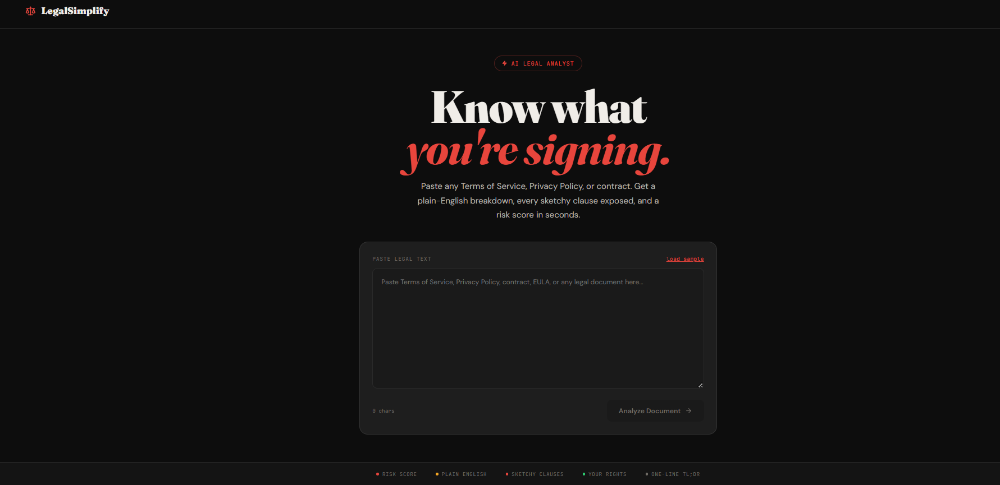
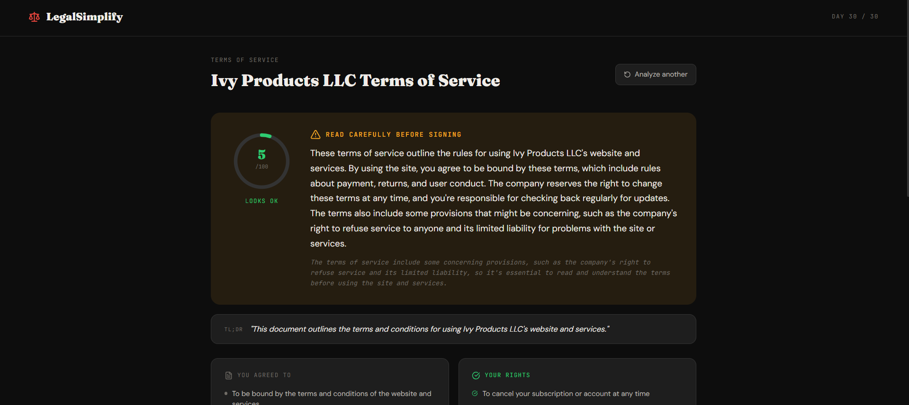
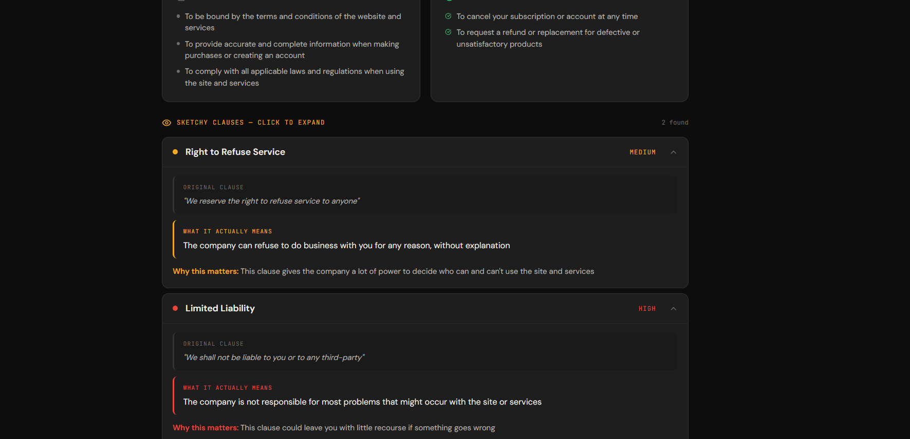

# LegalSimplify
Plain English legal document analyzer

Paste any Terms of Service, Privacy Policy, EULA, NDA, or contract. Get the sketchy parts highlighted, a plain English summary, quick flags, and an honest verdict.

---




---

FRONTEND_URL = 

---

## Features
- **Plain English summary** — what the document actually says, written like a friend explaining it
- **Sketchy clauses** — highlighted with severity (low/medium/high), exact quote, and plain explanation
- **Risk score** — 0–100 with animated meter
- **Quick flags** — sells your data? forced arbitration? auto-renews? can delete account?
- **Verdict** — Safe to sign / Read carefully / Proceed with caution / Avoid if possible
- Works with ToS, Privacy Policies, EULAs, NDAs, contracts, rental agreements

---

## Stack
| | |
|---|---|
| Backend | FastAPI + Python 3.11 |
| AI | Groq LLaMA 3.3 70B (free) |
| Frontend | React 18 + Vite |
| State | Zustand |
| Animations | Framer Motion |
| Fonts | Bebas Neue + Epilogue + JetBrains Mono |

---

## Quick Start

### Backend
```bash
cd legalsimp/backend
python -m venv venv
source venv/bin/activate      # Windows: venv\Scripts\activate
pip install -r requirements.txt

cp .env.example .env
# Edit .env → add GROQ_API_KEY (free at console.groq.com)

uvicorn app.main:app --reload
# → http://localhost:8000
```

### Frontend
```bash
cd legalsimp/frontend
npm install
npm run dev
# → http://localhost:5173
```

---

## Deploy to Render

### Backend — Web Service
| Field | Value |
|---|---|
| Root Directory | `legalsimp/backend` |
| Runtime | Python 3 |
| Build Command | `pip install -r requirements.txt` |
| Start Command | `uvicorn app.main:app --host 0.0.0.0 --port $PORT` |
| Env Var | `GROQ_API_KEY` = your key |

### Frontend — Static Site
| Field | Value |
|---|---|
| Root Directory | `legalsimp/frontend` |
| Build Command | `npm install && npm run build` |
| Publish Directory | `dist` |
| Env Var | `VITE_API_URL` = `https://your-backend.onrender.com/api` |

> After deploying backend, copy its URL into `VITE_API_URL` on the frontend service, then redeploy frontend.

---

## API

| Method | Endpoint | Description |
|---|---|---|
| POST | `/api/analyze` | Analyze legal text |
| GET | `/api/health` | Health check |

**Request:**
```json
{ "text": "paste your legal document here..." }
```

**Response:**
```json
{
  "title": "Spotify Terms of Service",
  "document_type": "Terms of Service",
  "one_liner": "...",
  "overall_risk": "medium",
  "risk_score": 62,
  "plain_summary": "...",
  "what_you_agree_to": ["..."],
  "sketchy_clauses": [
    {
      "title": "Perpetual Content License",
      "quote": "irrevocable, worldwide, royalty-free license...",
      "plain": "They can use your content forever, for anything",
      "severity": "high",
      "why_sketchy": "You lose control of your content permanently"
    }
  ],
  "your_rights": ["..."],
  "data_collected": ["..."],
  "can_delete_account": true,
  "sells_your_data": false,
  "can_change_terms": true,
  "arbitration_clause": true,
  "auto_renews": false,
  "verdict": "Read carefully before signing",
  "verdict_reason": "..."
}
```

---

## Notes
- Analyzes first 12,000 characters of long documents
- Not a substitute for actual legal advice
- Works best with English-language documents
